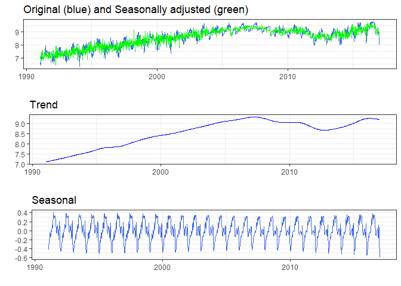
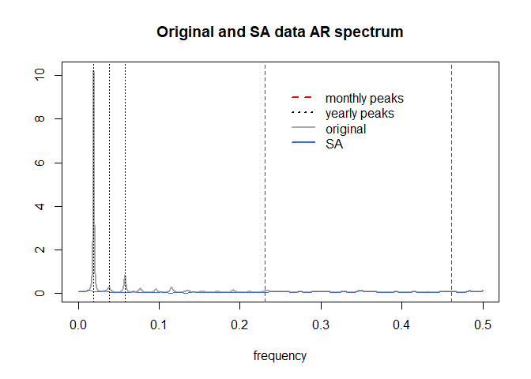
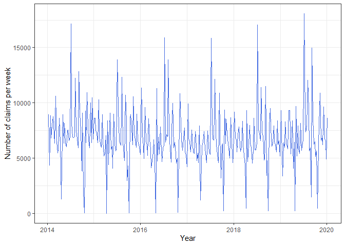
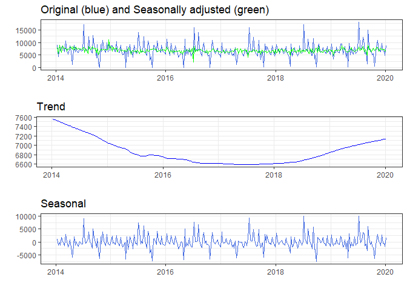
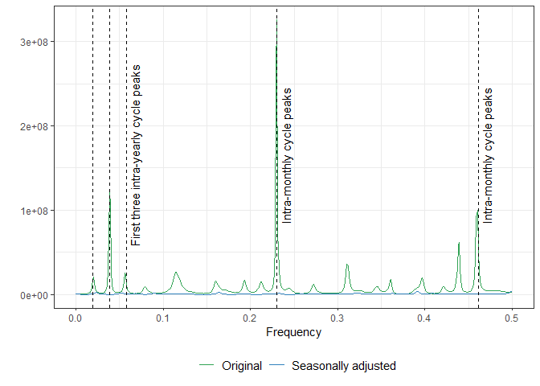
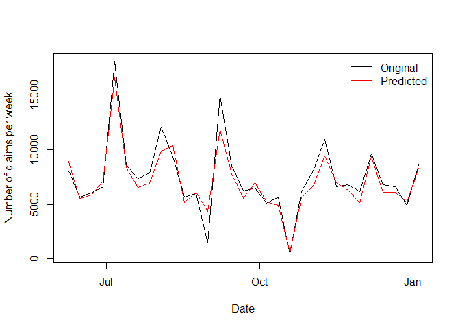

<!-- README.md is generated from README.Rmd. Please edit that file -->

# boiwsa

<!-- badges: start -->

[](https://cran.r-project.org/package=boiwsa)
[](https://github.com/timginker/boiwsa/commits/master)
[](https://cran.r-project.org/package=boiwsa)
<!-- badges: end -->

`boiwsa` is an R package for seasonal adjustment and forecasting of
weekly data. It provides a simple, easy-to-use interface for calculating
the seasonally adjusted estimates, as well as a number of diagnostic
tools for evaluating the quality of the adjustments. In this tutorial we
illustrate its functionality in seasonal adjustment and forecasting of
the weekly data.

The seasonal adjustment procedure approach aligns closely with the
locally-weighted least squares procedure introduced by Cleveland et
al. (2014) albeit with several adjustments. Firstly, instead of relying
on differencing to detrend the data, we opt for a more explicit approach
by directly estimating the trend through smoothing techniques. Secondly,
we incorporate a variation of Discount weighted regression (Harrison and
Johnston, 1984) to enable the seasonal component to evolve dynamically
over time.

We consider the following decomposition model of the observed series
$y_{t}$:

$$
y_{t}=T_{t}+S_{t}+H_{t}+O_{t}+I_{t},
$$

where $T_{t}$, $S_{t}$, $H_{t}$, $O_{t}$ and $I_{t}$ represent the
trend, seasonal, outlier, holiday- and trading-day, and irregular
components, respectively. To evade ambiguity, it is important to note
that in weekly data, $t$ typically denotes the date of the last day
within a given week. The seasonal component is specified using
trigonometric variables as:

``` math
\begin{eqnarray*}
S_{t} &=&\sum_{k=1}^{K}\left( \alpha _{k}^{y}\sin (\frac{2\pi kD_{t}^{y}}{
n_{t}^{y}})+\beta _{k}^{y}\cos (\frac{2\pi kD_{t}^{y}}{n_{t}^{y}})\right) +
\\
&&\sum_{l=1}^{L}\left( \alpha _{l}^{m}\sin (\frac{2\pi lD_{t}^{m}}{n_{t}^{m}}
)+\beta _{l}^{m}\cos (\frac{2\pi lD_{t}^{m}}{n_{t}^{m}})\right) ,
\end{eqnarray*}
```

where $D_{t}^{y}$ and $D_{t}^{m}$ are the day of the year and the day of
the month, and $n_{t}^{y}$ and $n_{t}^{m}$ are the number of days in the
given year or month. Thus, the seasonal adjustment procedure takes into
account the existence of two cycles, namely intrayearly and
intramonthly.

Like the X-11 method (Ladiray and Quenneville, 2001), the `boiwsa`
procedure uses an iterative principle to estimate the various
components. The seasonal adjustment algorithm comprises eight steps,
which are documented below:

- Step 1: Estimation of trend ($T_{t}^{(1)}$) using `stats::supsmu()`.

- Step 2: Estimation of the Seasonal-Irregular component:

$$y_{t}-T_{t}^{(1)}=S_{t}+H_{t}+O_{t}+I_{t}$$

- Step 2\*: Searching for additive outliers using the method proposed by
  Findley et al. (1998)

- Step 2\*\*: Identifying the optimal number of trigonometric variables

- Step 3: Calculation of seasonal factors, along with other potential
  factors such as $H_{t}$ or $O_{t}$, is done through DWR on the
  seasonal-irregular component extracted in Step 2. In this application,
  the discounting rate decays over the years. For each year $t$ and the
  observed year $\tau$, a geometrically decaying weight function is
  represented as: $w_{t}=r^{|t-\tau|}$, where $r \in (0,1]$. Several
  important points are worth mentioning. First, when $r=1$, the method
  simplifies to ordinary least squares regression with constant
  seasonality. On the contrary, smaller values of $r$ permit a more
  rapid rate of change in the seasonal component. However, it is advised
  against setting it below 0.5 to prevent overfitting. In addition, the
  choice of $r$ affects the strength of revisions in the seasonally
  adjusted data, with higher values of $r$ leading to potentially
  stronger revisions. Second, our methodology differs from the
  conventional one-way discounting, enabling the inclusion of future
  observations in the computation of seasonal factors. This approach
  circumvents the limitations of the forecasting methods discussed in
  Bandara et al. (2024). Finally, the choice of year-based discounting
  is driven by the fact that in traditional discount-weighted
  regression, even with a conservative choice of $r=0.95$, in weekly
  data, observations separated by more than 2 years would carry nearly
  negligible weight. Therefore, the use of year-based discounting
  prevents an overly rapid decay which may potentially lead to unstable
  estimates of the seasonal component.

- Step 4: Estimation of trend ($T_{t}^{(2)}$) from seasonally and
  outlier adjusted series using `stats::supsmu()` function (R Core Team,
  2013)

- Step 5: Estimation of the Seasonal-Irregular component:
  $$y_{t}-T_{t}^{(2)}=S_{t}+H_{t}+O_{t}+I_{t}$$

- Step 6: Computing the final seasonal factors (and possibly other
  factors such as $H_{t}$ or $O_{t}$) using discount weighted
  regression, as in step 3.

- Step 7: Estimation of the final seasonally adjusted series:
  $$y_{t}-S_{t}-H_{t}$$

- Step 8: Computing final trend ($T_{t}^{(3)}$) estimate from seasonally
  and outlier adjusted series using `stats::supsmu()`.

## Installation

To install boiwsa, you can use devtools:

``` r
# install.packages("devtools")
devtools::install_github("timginker/boiwsa")
```

Alternatively, you can clone the repository and install the package from
source:

``` bash
git clone https://github.com/timginker/boiwsa.git
cd boiwsa
R CMD INSTALL .
```

## Usage

### Example 1: Gasoline production in the US

Using `boiwsa` is simple. First, load the `boiwsa` package:

``` r
library(boiwsa)
```

Next, load your time series data into a data frame object. Here is an
example that is based on the `gasoline` data from the US Energy
Information Administration that we copied from the from the `fpp2`
package:

``` r
data("gasoline.data")
plot(gasoline.data$date,
     gasoline.data$y,
     type="l"
     ,xlab="Year",
     ylab=" ",
     main="Weekly US gasoline production")
```


Once you have your data loaded, you can use the `boiwsa` function to
perform weekly seasonal adjustment:

``` r
res <- boiwsa(
  x = gasoline.data$y,
  dates = gasoline.data$date
)
```

In general, the procedure can be applied with minimum interventions and
requires only the series to be adjusted (`x` argument) and the
associated dates (`dates` argument) provided in a date format. Unless
specified otherwise (i.e., `my.k_l = NULL`), the procedure automatically
identifies the best number of trigonometric variables to model the
intra-yearly ($K$) and intra-monthly ($L$) seasonal cycles based on the
Akaike Information Criterion corrected for small sample sizes (AICc).
The information criterion can be adjusted through the `ic` option. Like
other software, there are three options: “aic”, “aicc”, and “bic”. The
weighting decay rate is specified by `r`. By default $r=0.8$ which is
similar to what is customary in the literature (see Ch. 2 in Harvey
(1990)).

In addition, the procedure automatically searches for additive outliers
(AO) using the method described in Appendix C of Findley et al. (1998).
To disable the automatic AO search, set `auto.ao.search = F`. To add
user-defined AOs, use the `ao.list` option. As suggested by Findley et
al. (1998), the $t$-statistic threshold for outlier search is by default
set to $3.8$. However, since high-frequency data are generally more
noisy (Proietti and Pedregal, 2023), it could be advantageous to
consider setting a higher threshold by adjusting the `out.threshold`
argument.

The `boiwsa` function returns an S3 class object containing the results.
The seasonally adjusted series is stored in a vector called `sa`. The
estimated seasonal factors are stored as `sf`. In addition, the user can
see the number of trigonometric terms chosen in automatic search
(`my.k_l`) and the position of additive outliers (`ao.list`) found by
the automatic routine.

After the seasonal adjustment, we can plot the adjusted data to
visualize the seasonal pattern:

``` r
plot(res)
```



To assess the quality of the adjustment, we can plot the autoregressive
spectrum of the original and seasonally adjusted data, as illustrated in
the code below:

``` r
plot_spec(res)
```



It is evident that the series originally had a single intra-yearly
seasonal cycle, but this component was completely removed by the
procedure.

We can also inspect the output to check if the number of trigonometric
terms chosen by the automatic procedure matches our visual findings:

``` r
print(res)
#> 
#>  number of yearly cycle variables:  12 
#>  number of monthly cycle variables:  0 
#>  list of additive outliers:  1998-03-28
```

As can be seen, the number of yearly terms, $K$, is 12 and the number of
monthly terms is zero, which is consistent with the observed spectrum.

### Example 2: Initial unemployment claims in Israel

Here, we consider the weekly number of initial registrations at the
Israeli Employment Service. Registration and reporting at the Employment
Service are mandatory prerequisites for individuals seeking to receive
an unemployment benefit. Therefore, applicants are expected to register
promptly after their employment has been terminated. Given that most
employment contracts conclude toward the end of the month, an increased
number of applications is anticipated at the beginning of the month,
leading to an intra-monthly seasonal pattern. Additionally, as can be
seen in the Figure below, on an annual basis, three distinct peaks are
observed, with the final one occurring in August. This peak is closely
tied to seasonal workers, leading to the creation of an intra-yearly
cycle.

``` r
library(tidyverse)
#> ── Attaching core tidyverse packages ──────────────────────── tidyverse 2.0.0 ──
#> ✔ dplyr     1.1.4     ✔ readr     2.1.4
#> ✔ forcats   1.0.0     ✔ stringr   1.5.1
#> ✔ ggplot2   3.4.4     ✔ tibble    3.2.1
#> ✔ lubridate 1.9.3     ✔ tidyr     1.3.0
#> ✔ purrr     1.0.2     
#> ── Conflicts ────────────────────────────────────────── tidyverse_conflicts() ──
#> ✖ dplyr::filter() masks stats::filter()
#> ✖ dplyr::lag()    masks stats::lag()
#> ℹ Use the conflicted package (<http://conflicted.r-lib.org/>) to force all conflicts to become errors
ggplot() +
  geom_line(aes(
    x = lbm$date,
    y = lbm$IES_IN_W_ADJ
  ), color = "royalblue") +
  theme_bw() +
  ylab("Number of claims per week") +
  xlab("Year")
```



Furthermore, each year, there are two weeks in which the activity
plunges to nearly zero due to the existence of two moving holidays
associated with Rosh Hashanah and Pesach. Moreover, a working day effect
is expected, which leads to a reduced number of applications in weeks
with fewer working days. These effects are captured and modeled through
additional variables generated by the dedicated functions in `boiwsa`.

To generate a working day variable, we use the `boiwsa::simple_td`
function, designed to aggregate the count of full working days within a
week and normalize it. This function requires two parameters: the data
dates and a `data.frame` object containing information about working
days. The `data.frame` should be in a daily frequency and contain two
columns: “date” and “WORKING_DAY_PART”. For a complete working day, the
“WORKING_DAY_PART” column should be assigned a value of 1, for a half
working day 0.5, and for a holiday, the value should be set to 0.

Moving holiday variables can be created using the `boiwsa::genhol`
function. These variables are computed using the Easter formula in Table
2 of Findley et al. (1998), with the calendar centering to avoid bias,
as indicated in the documentation. In the present example, the impact of
each holiday is concentrated within a single week, resulting in a
noticeable drop and subsequent increase in the number of registrations
during the following week. To account for this effect, we employ dummy
variables that are globally centered. These dummy variables are created
using a custom function - `boiwsa::my_rosh`, which is created for this
illustrative scenario.

The code below illustrates the entire process based on the
`boiwsa::lbm dataset`: creation of working day adjustment variables
using the `boiwsa::simple_td` function; creation of moving holiday
variables using the dedicated functions, and adding the combined input
into the `boiwsa::boiwsa` function.

``` r
# creating an input for simple_td 
dates_il %>%
  select(DATE_VALUE, ISR_WORKING_DAY_PART) %>%
  `colnames<-`(c("date", "WORKING_DAY_PART")) %>%
  mutate(date = as.Date(date)) -> df.td
# creating a matrix with a working day variable
td <- simple_td(dates = lbm$date, df.td = df.td)

# generating the Rosh Hashanah and Pesach moving holiday variables
rosh <- my_rosh(
  dates = lbm$date,
  holiday.dates = holiday_dates_il$rosh
)
# renaming (make sure that all the variables in H have distinct names)
colnames(rosh) <- paste0("rosh", colnames(rosh))

pesach <- my_rosh(
  dates = lbm$date,
  holiday.dates = holiday_dates_il$pesah,
  start = 3, end = -1
)
colnames(pesach) <- paste0("pesach", colnames(pesach))


# combining the prior adjustment variables in a single matrix
H <- as.matrix(cbind(rosh[, -1], pesach[, -1], td[, -1]))
# running seasonal adjustment routine
res <- boiwsa(
  x = lbm$IES_IN_W_ADJ,
  dates = lbm$date,
  H = H,
  out.threshold = 5
)
```

Subsequently, we can visually examine the results of the procedure:

``` r
plot(res)
```



As we can see in the plot, the procedure has successfully eliminated the
annual and monthly seasonal cycles, along with the influences of moving
holidays.

Following a thorough visual examination of the seasonally adjusted data,
we can now move forward with the spectrum diagnostics. As illustrated in
the Figure below, corroborating our initial analysis of potential
underlying seasonal patterns, it becomes evident that the data has two
distinct seasonal cycles. Additionally, it is noteworthy that our
procedure successfully removed the corresponding peaks, thereby
highlighting its effectiveness.

``` r
plot_spec(res)
```



### Forecasting

It is also possible to forecast weekly data using the predict method for
`boiwsa`. The prediction is based on the `forecast::auto.arima` model
fitted to the seasonally and outlier-adjusted data, which is then
combined with the seasonal factor estimates from `boiwsa`.

The code below illustrates the entire process:

``` r
x <- boiwsa::lbm$IES_IN_W_ADJ
dates <- boiwsa::lbm$date
# train-test split (using 90% of observations for train)
n_train <- round(length(x) * 0.9) 
n_test <- (length(x) - n_train)
h_train <- H[1:n_train, ]
h_test <- tail(H, n_test)
x_train <- x[1:n_train]
x_test <- tail(x, n_test)
dates_train <- dates[1:n_train]
dates_test <- tail(dates, n_test)

fit <- boiwsa(
  x = x_train,
  dates = dates_train,
  H = h_train
)

fct <- predict(fit,
  n.ahead = n_test,
  new_H = h_test
)

# Visualizing predictions

plot(dates_test,
     x_test,type="l",
     ylab="Number of claims per week",
     xlab="Date")
lines(dates_test,
      fct$forecast$mean,
      col="red")
legend(
  "topright",
  legend = c("Original", "Predicted"),
  lwd = c(2, 1),
  col = c("black", "red"),
  bty = "n"
)
```



# References

Bandara, K., Hyndman, R. J. and C. Bergmeir (2024). MSTL: A
seasonal-trend decomposition algorithm for time series with multiple
seasonal patterns. International Journal of Operational Research, 2024.
In press.

Cleveland, W.P., Evans, T.D. and S. Scott (2014). Weekly Seasonal
Adjustment-A Locally-weighted Regression Approach (No. 473). Bureau of
Labor Statistics.

Findley, D.F., Monsell, B.C., Bell, W.R., Otto, M.C. and B.C Chen
(1998). New capabilities and methods of the X-12-ARIMA
seasonal-adjustment program. Journal of Business & Economic Statistics,
16(2), pp.127-152.

Harrison, P. J. and F. R. Johnston (1984). Discount weighted regression.
Journal of the Operational Research Society 35(10), 923–932.

Hyndman, R. (2023). fpp2: Data for “Forecasting: Principles and
Practice” (2nd Edition). R package version 2.5.

Harvey, A. C. (1990). Forecasting, structural time series models and the
Kalman filter. Cambridge University Press.

Ladiray, D. and B. Quenneville (2001). Seasonal adjustment with the X-11
method.

Proietti, T. and D. J. Pedregal (2023). Seasonality in High Frequency
Time Series. Econometrics and Statistics, 27: 62–82, 2023.

R Core Team (2013). R: A Language and Environment for Statistical
Computing. Vienna, Austria: R Foundation for Statistical Computing. ISBN
3-900051-07-0.

# Disclaimer

The views expressed here are solely of the author and do not necessarily
represent the views of the Bank of Israel.

Please note that `boiwsa` is still under development and may contain
bugs or other issues that have not yet been resolved. While we have made
every effort to ensure that the package is functional and reliable, we
cannot guarantee its performance in all situations.

We strongly advise that you regularly check for updates and install any
new versions that become available, as these may contain important bug
fixes and other improvements. By using this package, you acknowledge and
accept that it is provided on an “as is” basis, and that we make no
warranties or representations regarding its suitability for your
specific needs or purposes.
