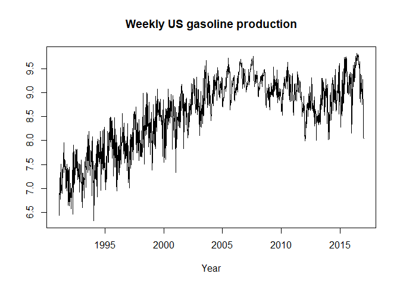

<!-- README.md is generated from README.Rmd. Please edit that file -->

# boiwsa

<!-- badges: start -->
<!-- badges: end -->

boiwsa is a package for seasonal adjustment of weekly data. It is
implemented using a locally-weighted least squares procedure.

## Installation

You can install the development version of boiwsa from
[GitHub](https://github.com/) with:

``` r
# install.packages("devtools")
devtools::install_github("timginker/boiwsa")
```

## Example

TBA

``` r
library(boiwsa)
data("gasoline.data")

plot(gasoline.data$date,gasoline.data$y,type="l",xlab="Year",ylab=" ", main="Weekly US gasoline production")
```



## Performing seasonal adjustment using defaults.

``` r
res=boiwsa(x=gasoline.data$y,dates=gasoline.data$date)
```

## Inspecting the results:

Number of trigonometric terms chosen by the automatic procedure

``` r
res$my.k_l
#>   yearly variables monthly variables
#> 1               12                 0
```

## Plotting

``` r
plot(gasoline.data$date,gasoline.data$y,type="l",xlab="Year",ylab=" ", main="Weekly US gasoline production")
lines(gasoline.data$date,res$sa,col="red")
legend(
  "topleft",
  legend = c("Original", "SA"),
  lwd = c(2,2),
  col = c("black", "red"),
  bty = "n"
)
```


## Inspecting the spectrum

``` r
plot_spec(res)
```


